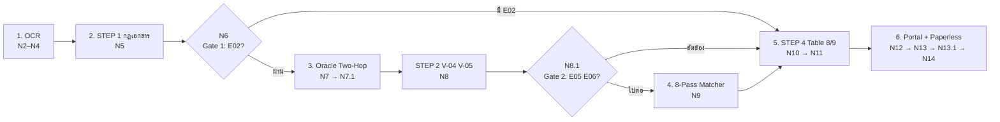

# AIVA PO-INV Matching — n8n Explanatory Flow (Standard v6.6)

> **เอกสารนี้อธิบาย "ตรรกะและเหตุผล" ของ Workflow ทั้งเส้น** โดยใช้เลขที่เอกสารจริงเป็นตัวอย่าง
> เจตนา: อ่านแล้วเข้าใจว่า *ทำไม* แต่ละจุดจึงตัดสินใจแบบนั้น โดยไม่ต้องเปิดดูโค้ดทีละโหนด
>
> **Workflow:** `AIVA PO-INV Matching Verification v6.6 (Explanatory Flow)` — ID `aLUCmn3l0bZDjbVV`
> **Canvas:** http://localhost:5678/workflow/aLUCmn3l0bZDjbVV (สถานะ: inactive)
> **มาตรฐานอ้างอิง:** `AH-IT-DOC-PO-INV-Matching-Standard-v6.6-DRAFT-261001-WT`
> **Output Schema:** Table 9 Schema v1.5 | **Decision:** Table 8 | **Exception:** Table 7 (E01–E15)
> **Parity Target:** Python FastAPI Engine (`app/core/rules.py`, `app/services/pipeline.py`, `app/services/oracle_mcp.py`)
> **เอกสารที่แทนที่:** `n8n_flow_v6_5.md` (คงไว้เป็นประวัติ ยังใช้เปิดเทียบรหัส exception เก่าได้)

---

## 0. ภาพรวม 6 ขั้นตอน (อ่านตารางนี้ก่อนลงรายละเอียด)

| ขั้น | ทำอะไร | โหนดหลัก | เกณฑ์/ประตู (Gate) |
|---|---|---|---|
| **1** | OCR: อ่านบิลเป็น JSON | `N2 → N2.1 → N2.2 → N2.3a → N2.3b → N2.4 → N3 → N4` | ไม่มี — เป็นขั้นตอนสกัดข้อมูล |
| **2** | กติกา "ตัวบิล" ล้วน V-01/V-02/V-03/V-06 | `N5 → N6` | **⚡ Gate 1** — `E02` ตัดไป STEP 4 ไม่ยิง Oracle |
| **3** | ดึงของจริงจาก Oracle EBS (Two-Hop Multi-PO) + V-04/V-05 | `N7 → N7.1 → N8 → N8.1` | **⚡ Gate 2** — `E05`/`E06` ตัดไป STEP 4 ไม่เข้า Line Matcher |
| **4** | จับคู่บรรทัด 8-Pass + V-07/V-08/V-09 | `N9` | ห้ามใช้แถวใบรับซ้ำ |
| **5** | ตัดสิน Table 8 + ประกอบ Table 9 v1.5 | `N10 → N11` | `N11` กันไม่ให้ออก code นอก `E01–E15` |
| **6** | ส่งออกผล Portal + Paperless | `N12 → N13 → N13.1 → N14` | Portal ล้มแล้ว flow ต้องไม่ตาย |



**หลักคิดเดียวที่ต้องจำ:** *AI สกัดข้อมูล — โค้ดเป็นผู้ตัดสินใจ* (หลักการ D1) Vision LLM ห้ามคำนวณและห้ามตัดสินเอง ทุกตัวเลขที่ใช้อ้างสิทธิ์ถูกคำนวณซ้ำใน Code node ทั้งหมด

---

## 1. ขั้นที่ 1 — OCR: อ่านบิลเป็นข้อมูลเชิงโครงสร้าง

### ตรรกะ
1. **เลือกงาน** — `N2` ดึงเอกสารจาก Paperless-ngx เฉพาะใบที่ติดแท็ก `invoice` (tag id 5) และ **ยังไม่** ติดแท็ก `check n8n` (tag id 12)
   → ถ้าไม่มีเอกสารค้างเลย `N2.2` จะพาไป `Main: Result - All Already Processed` จบทันที (กันบิลถูกตรวจซ้ำเป็นรอบที่สอง)
2. **แปลงเป็นภาพ** — `N2.3a` ดาวน์โหลดไฟล์ PDF → `N2.3b` Render เป็นภาพ JPEG สูงสุด 4 หน้า (บิลจริงส่วนใหญ่ 1–2 หน้า)
3. **ให้ AI อ่าน** — `N2.4` ประกอบ Prompt (โครง JSON ตาม Table 3 + กฎคำนวณน้ำหนักม้วนเหล็ก + OCR text สำรอง) → `N3` ยิงเข้า LiteLLM Proxy โมเดล **`deepseek-v4-flash`** แบบ `temperature 0` และบังคับตอบเป็น JSON object
4. **จัดระเบียบข้อมูล** — `N4` Normalize:
   - Tax ID ให้เหลือ 13 หลัก (ตัดขีด/ช่องออก)
   - PO number 8 หลัก + แยก **Release number** ออกจากเลขที่บิลรูปแบบ `0642/6` หรือ `40118638-170-30485114`
   - วันที่ พ.ศ. → ค.ศ. และจัดรูปแบบตัวเลข (ตัด `,` ออกจากจำนวนหลายหลัก, คงทศนิยม 2 ตำแหน่ง)
   - UOM เข้าพจนานุกรม (BOX/BX · PCS/EA · KGS/KG · SHEET/SHT)
   - ตั้งค่า `pages_complete` เพื่อส่งต่อให้ V-01 และ V-06 ใช้ตัดสิน

### ตัวอย่าง (input → output ของ N4)
| บิลพิมพ์ไว้ | หลัง Normalize |
|---|---|
| `1,250.00` | `1250` |
| `0135-535-0020-53` | `0135535002053` |
| `40118928-87-30485114` | PO `40118928` · Release `87` · เลข 30485114 (เลขที่ส่งของ) ถูกทิ้ง |
| `05/09/2569` | `2026-09-05` |

> **ทำไมต้องมีขั้น Normalize:** โมเดล vision เขียนตัวเลขได้หลายรูปแบบเสมอ ถ้าปล่อยรูปแบบหลากหลายลงไป STEP 1–3 จะคำนวณเพี้ยน และเป็นต้นตอของ false positive ที่แก้ไม่จบ

---

## 2. ขั้นที่ 2 — STEP 1: ตัดสินจาก "ตัวบิล" ก่อนไปยุ่งกับ ERP (`N5`)

ขั้นนี้ **ไม่เรียก Oracle แม้แต่ครั้งเดียว** ทุกกฎใช้เฉพาะข้อมูลที่ AI สกัดมา แล้วคำนวณใหม่เอง

| กฎ | ตรวจอะไร | ขีดเส้น | Exception | ระดับ |
|---|---|---|---|---|
| **V-01** | ฟิลด์บังคับครบ (customer_name / address / tax_id, invoice_num, po_number, lines) และสแกนครบหน้า | — | `E01` | Medium |
| **V-02** | `จำนวน × ราคาต่อหน่วย = ยอดเงินบรรทัด` | ต่าง > **0.50 บาท** ต่อบรรทัด | `E02` | High |
| **V-03** | รวมบรรทัด = ฐานภาษี · ฐาน × 7% = VAT · ฐาน + VAT = ยอดสุทธิ | ต่าง > 0.50 (sub/grand) หรือ > 1.00 (VAT) = `E03` · ต่างเพียงเศษปัดเศษ = `E04` | `E03` / `E04` | High / Low |
| **V-06** | ลายเซ็น **ผู้รับของ** และ **ผู้ส่งของ/ผู้ขาย** | ขาดผู้รับของ = High · ขาดผู้ส่งของ = Medium | `E08` | High / Medium |

### ⚡ Gate 1 — Circuit Breaker ที่ `N6: IF: Gate 1 Breaker (E02)`
ถ้า `N5` ส่ง `has_e02 = true` → `N6` พาข้ามไป `N10` ทันที **ไม่ยิง Query หา Oracle EBS**

**เหตุผลที่เลือกตัดที่ `E02` เท่านั้น**
- บิลที่คูณเลขในตัวเองยังไม่ถูก แสดงว่าตัวเลขชุดนี้เชื่อถือไม่ได้ทั้งฉบับ — เอาไปเทียบกับ ERP ก็มีแต่สร้าง exception ปลอม ๆ จำนวนมาก
- บิลที่ผิด arithmetic มีไม่ถึง 1% ของเคสจริง แต่ถ้าไม่ตัด จะเสียเวลา query ~0.5 วินาทีต่อใบ และผู้ตรวจจะเห็น E09/E13/E14 เต็มไปหมดทั้งที่ต้นเหตุอยู่บรรทัดเดียว
- ผลลัพธ์บันทึกตรงไปตรงมาว่าไม่ได้เรียก ERP: `oracle_data.queried = false` + `reason = "Bypassed due to E02 Line Math Error"` + `decision.halted_by = "V-02"`

### ตัวอย่าง Gate 1 ทำงาน
บรรทัดที่ 2 ของบิล: `10 ชิ้น × 100.00 = 1,000.00` แต่บิลพิมพ์ยอด **900.00**
→ `N5` คำนวณซ้ำได้ 1000 ≠ 900 (ต่าง 100 > 0.50) → `E02` High → `N6` ตัดวงจร → `N10` ตัดสิน **Hold** (V-04/V-05/V-07/V-08/V-09 เป็น `not_evaluated`) → ผู้ใช้เห็นสาเหตุเดียวชัดเจนว่า "เลขบิลผิด" ไม่ใช่ "ของไม่ตรง"

---

## 3. ขั้นที่ 3 — STEP 2: Two-Hop Multi-PO ดึงข้อมูลจริงจาก Oracle EBS

### Hop 1 — เปลี่ยน "เลขที่ PO" ให้เป็น "Supplier Tax ID" (~0.11 วินาที)
อ่านจาก `PO_HEADERS_ALL` + `PO_VENDORS` ด้วย `COALESCE(VAT_REGISTRATION_NUM, NUM_1099)`
**ใช้เมื่อไร:** บิลไม่พิมพ์ Tax ID ผู้ขาย หรือบิลเดียวพาดผ่านหลาย PO — จะได้ "กุญแจ" ไปเปิด Hop 2
*(ฝั่ง Python: `oracle_mcp.resolve_supplier_tax_id_by_po()` — ยิงเมื่อ Tax ID ว่างและมีเลข PO)*

**บน Canvas ไม่มียิงแยก** — Hop 1 ถูก *บีบเข้ามาเป็น subquery ในคำสั่งเดียว* ของ Hop 2
โดยทำเฉพาะกรณีเดียวกับ Python (บิลมีเลขที่บิล + Tax ID ว่าง + PO ไม่ขึ้นต้น `INV`) ถ้า OCR อ่าน Tax ID มาได้ จะใช้ค่าที่อ่านได้โดยตรง ไม่เข้า subquery

### Hop 2 — หา "แถวรับสินค้า" จาก (Tax ID ผู้ขาย + เลขที่บิล) (~0.49 วินาที)
จุดสำคัญ: เลขที่บิลที่พนักงานรับของจดลง ERP **ไม่ได้อยู่คอลัมน์เดียว** มันอาจถูกกรอกเป็น
`SHIPMENT_NUM` (เลขที่ใบรับ/GR No.) หรือ `PACKING_SLIP` หรือ `WAYBILL_AIRBILL_NUM`
→ Query จึงค้น **ทั้ง 3 คอลัมน์พร้อมกัน** (พร้อม variant แบบมี/ไม่มี `/`) ร่วมกับ Tax ID ผู้ขาย

**Fallback:** ถ้าค้นด้วยเลขที่บิลแล้วไม่เจอแถว → ดึงจาก **เลขที่ PO ทุกตัวของบิล** แทน (`ph.SEGMENT1 IN (...)`)

```
WHERE ( <Tax ID> = COALESCE(pv.VAT_REGISTRATION_NUM, pv.NUM_1099)   -- Tax ID จาก OCR หรือ subquery Hop 1
        AND (h.SHIPMENT_NUM IN ('ED6909/0837','ED69090837')
          OR h.PACKING_SLIP IN ('ED6909/0837','ED69090837')
          OR h.WAYBILL_AIRBILL_NUM IN ('ED6909/0837','ED69090837')))
   OR ( NOT EXISTS (<branch เลขที่บิล>)                              -- fallback เมื่อ branch บนไม่เจอแถว
        AND ph.SEGMENT1 IN ('40083989','40089558','40118686') )
```

### ⚠️ ประเด็นที่ 1 — การยิงครั้งเดียวต้องไม่ทำให้ผลลัพธ์เพี้ยน
Canvas ยิง Oracle **ครั้งเดียวต่อเอกสาร** (Python ยิง 2 ครั้ง) ถ้ายิงแบบเดิมคือ
`(ค้นด้วยเลขที่บิล) OR (ph.SEGMENT1 IN (...))` เฉย ๆ branch PO จะดึง **ทุกใบรับของ PO นั้นทั้งประวัติศาสตร์**

| กรณีทดสอบ (ตรวจกับ Oracle จริง) | แบบเดิม | แบบปัจจุบัน |
|---|---|---|
| `ED6909/0837` + PO `40083989` (PO เดี่ยวมีใบรับหลายร้อยใบ) | **8,359 แถว** (~2.5 MB ต่อการรัน 1 ใบ) | **7 แถว** |
| บิลไม่มีใน ERP + PO `42052835` (ทดสอบ fallback) | 4 แถว | 4 แถว (ตรงกับ log Python "fallback") |

การแก้ทำได้ 2 อย่างในโหนดเดียว โดยไม่ต้องเพิ่ม node/IF บน canvas
1. **inline Hop 1** — ใส่ subquery หาทด Tax ID ที่ว่าง ทำให้การค้นด้วยเลขที่บิล "เจอง่ายขึ้นมาก"
2. **`NOT EXISTS` guard** — branch PO (fallback) จะทำงานก็ต่อเมื่อ branch เลขที่บิลไม่เจอแถว
   ซึ่งคือตรรกะ "ยิงบิลก่อน ไม่เจอค่อยยิง PO" ของ Python เป๊ะ ๆ

### ⚠️ ประเด็นที่ 2 — สถานะ Parity ปัจจุบัน (ยืนยันแล้ว)
| ประเด็น | Python Engine | n8n Canvas |
|---|---|---|
| Hop 1 (PO → Tax ID) | query แยก 1 ครั้ง เมื่อ Tax ID ว่าง | subquery เดียวในคำสั่งของ Hop 2 (เงื่อนไขการยิงเหมือนกัน) |
| Hop 2 + Fallback | ยิงด้วยเลขที่บิลก่อน ไม่เจอจึงยิงด้วย PO = **2 queries** | **1 query** + `NOT EXISTS` guard + `N7.1` เลือกแถวจากเลขที่บิลก่อนเสมอ |
| ผลลัพธ์ | 7 แถว / GR `510522788` | 7 แถว / GR `510522788` — **เท่ากัน 100%** |

### ตัวอย่างจริงหลาย PO: `ED6909/0837`
1. **Hop 1** — PO แรกของบิล `40083989` → Tax ID `0135535002053` (J. PHIPHAT AUTOPART INDUSTRY CO., LTD.)
   *(ใน canvas ค่านี้มาจาก subquery เพราะ OCR อ่าน Tax ID จากบิลไม่เจอ)*
2. **Hop 2** — ค้นด้วย Tax ID + `ED6909/0837` (3 คอลัมน์) → ได้ **7 บรรทัดข้าม 3 PO** (`40083989`, `40089558`, `40118686`) บนใบรับเดียวกัน `510522788` ผู้รับ `Oracle, Concurrent` ลูกค้า `0107545000179`
3. **ผล** — ยอดรวมบิลกับยอดรับตรงกันได้ตั้งแต่แรก ถ้าย้อนไปใช้ตรรกเดิมที่ผูกกับ PO เดี่ยว (v6.4) จะเห็น "ของไม่ครบ" ปลอม ๆ แล้วจบที่ Hold ทั้งที่ถูกต้อง

### STEP 2 Rules ที่ `N8: Code: STEP 2 (Receipt & Customer)`
| กฎ | ตรรกะ | ผลลัพธ์ |
|---|---|---|
| **V-04** | ไม่นับแถวที่ `QUANTITY_RECEIVED = 0` · ไม่พบใบรับเลย หรือสถานะ `EXPECTED` (ยังไม่ได้ของจริง) | `E05` High |
| **V-04** | พบ `RECEIPT_NUM` ที่รับแล้วมากกว่า 1 ใบ | `E06` High |
| **V-04** | SQL คืนมาชนเพดานปลอดภัย **50 แถว** | `Manual Review` (Medium) |
| **V-05** | เทียบ Tax ID ลูกค้า (อ่านจาก `FINANCIALS_SYSTEM_PARAMS_ALL` ของ OU ที่รับของ แบบ dynamic 100%) แล้วไม่ตรง | `E07` **High** |
| **V-05** | Tax ID ตรงแล้ว แต่รหัสไปรษณีย์/สาขาไม่ตรง | `E07` **Medium** |
| เสริม | ธง Intercompany จาก Scalar Subquery บน `financials_system_params_all` (ไม่ hardcode อีกต่อไป) | `invoice_summary.intercompany` |

### ⚡ Gate 2 — Circuit Breaker ที่ `N8.1: IF: Gate 2 Breaker (E05 E06)`
ถ้าพบ `E05` หรือ `E06` (หรือเข้าเงื่อนไข Manual Review) → ข้าม `N9` ไป `N10` เลย
**เหตุผล:** Line Matcher ต้องการ "ชุดแถวใบรับชุดเดียวที่ชัดเจน" — ถ้าไม่มีแถวเลย (E05) หรือมีหลายใบรับเกินกว่าจะรู้ว่าบิลนี้วางกับการรับครั้งไหน (E06) การจับคู่จะกลายเป็นการเดา ระบบจึงรายงานตามจริง: V-07/V-08/V-09 = `not_evaluated`
**ต้องระบุตัว breaker ด้วย:** `decision.halted_by = "V-04"` (ฝั่ง Python ใช้ `rules.gate_halt_reason()` — Gate 1 = `V-02`, Gate 2 = `V-04`, กรณี Manual Review จาก STEP 2 = `V-05`) Canvas ต้องใส่ค่าเดียวกันที่ `N8.1` branch ก่อนเข้า `N10` ไม่งั้น Table 9 จะต่างกันทั้งที่ผล rules เท่ากัน

---

## 4. ขั้นที่ 4 — 8-Pass Bipartite Line Matcher (`N9`)

### หลักการจับคู่
"บรรทัดบิล 1 บรรทัด ↔ แถวใบรับ 1 แถว" และ **แถวใบรับที่ถูกใช้แล้วห้ามใช้ซ้ำ**
ไล่จากหลักฐานแข็งไปอ่อน — จับคู่ได้แล้วไม่ไป Pass หลัง (8 Pass, Greedy Bipartite)

| Pass | หลักฐานที่ใช้จับคู่ | หมายเหตุ |
|---|---|---|
| 1 | ราคาต่อหน่วยตรงเป๊ะ **และ** จำนวนตรง | เลือกแถวที่คำบรรยายคล้ายที่สุดเป็น tie-breaker |
| 2 | ราคาต่าง **ในกรอบ (≤ 1% และ ≤ 200 บาท)** + จำนวนตรง | ผลต่างนี้จะกลายเป็น `E12` Medium |
| 3 | ยอดเงินบรรทัด (เฉพาะเมื่อยอดรวมตรง 100%) | ± 1.00 บาท |
| 4 | Item Number ปรากฏในคำบรรยายของบิล | เลือกแถวที่ราคาใกล้ที่สุด |
| 5 | ราคาตรงอย่างเดียวกับจำนวนไม่ตรง | เคสงวดส่งของบางส่วน |
| 6 | คำบรรยายคล้ายกัน (มี token ร่วม) | — |
| 7 | เลขที่บรรทัดตรงกัน | ใช้เมื่อหลักฐานเชิงเนื้อหาหมดแล้ว |
| 8 | แถวที่เหลือ / แถวแรกที่ยังไม่ถูกใช้ | แถวสำรองสุดท้าย |

**UOM Dictionary** (เทียบหลัง normalize เท่านั้น): `BOX ≡ BX` · `PCS ≡ EA ≡ ชิ้น ≡ SET` · `KGS ≡ KG ≡ กก` · `SHEET ≡ SHT` — ไม่ข้ามกลุ่ม (BOX ≠ PCS)

### V-08 เทียบจำนวนกับอะไร — ประเด็นที่มาตรฐาน v6.6 เปลี่ยน
เทียบกับ **`QUANTITY_RECEIVED` (จำนวนที่รับจริงในใบรับ)** ไม่ใช่ "ยอดคงเหลือที่ยังไม่วางบิล" (`QUANTITY_BILLED` เก็บไว้แสดงเป็นข้อมูลอ้างอิงเท่านั้น)
**เหตุผล:** ใบรับในอดีตอาจถูกวางบิลไปแล้วบางส่วน การเอายอดคงเหลือมาเทียบจะทำให้บิลที่ถูกต้องกลายเป็น E14/E15 ปลอม ๆ (false positive) ซึ่งเป็นปัญหาที่พบจริงตอนทดสอบกับข้อมูล ERP ย้อนหลัง

| Exception | เมื่อไร | ระดับ |
|---|---|---|
| `E13` | ไม่พบแถวคู่ในใบรับเลย | High |
| `E09` | ราคาต่างเกินกรอบ (>1% หรือ >200 บาท) | High |
| `E12` | ราคาต่างในกรอบ | Medium |
| `E10` | UOM ไม่ตรงหลังแปลง | Medium |
| `E14` | วางบิล **เกิน** จำนวนรับ (`inv qty > QUANTITY_RECEIVED`) | High |
| `E15` | วางบิล **น้อยกว่า** จำนวนรับ (วางบางส่วน) | Medium |
| `E03` | V-09: ฐานภาษียอดบิล ≠ ยอดมูลค่ารับรวม (ต่าง > 0.50) | High |

### ตัวอย่างเดินตาม Pass (ตัวเลขประกอบ)
บิล 3 บรรทัด / ใบรับ `510522788` มี 3 แถว

| บรรทัดบิล | แถวใบรับ | Pass ที่จับได้ | ผล |
|---|---|---|---|
| `แผ่นเรียบ 1238x1220x0.35` 50 BOX @ 138.89 | แถว 1 · 50 BOX @ 138.89 | 1 | PASS |
| `โครงหลังคาเหล็ก` 100 PCS @ 250.00 | แถว 2 · 100 PCS @ 249.00 (ต่าง 1.00 = 0.4%) | 2 | `E12` Medium |
| `น็อต M8` 2000 PCS @ 1.50 | แถว 3 · 2,100 PCS @ 1.50 | 1 ไม่ผ่าน (จำนวนไม่ตรง) → 5 | `E15` Medium (วางบางส่วน) |

สรุป: ไม่มี High → **Review** · ผู้รับเรื่อง = `user` (เพราะมี `E15` ซึ่งอยู่ในรายการ User Task)

---

## 5. ขั้นที่ 5 — STEP 4: Table 8 Decision Matrix + Table 9 Schema v1.5 (`N10` → `N11`)

### ตารางตัดสินใจ (Table 8) — ใช้ระดับสูงสุดที่พบเป็นตัวตัดสิน
| ลำดับ | เงื่อนไข | สถานะ | ส่งถึง |
|---|---|---|---|
| 1 | ORG_ID ไม่ทราบ / SQL ชนเพดาน 50 แถว / อ่านเอกสารไม่ได้ทั้งฉบับ | **Manual Review** | `accounting` |
| 2 | มีรหัส High: `E02 E03 E05 E06 E07(Tax ID) E08(ผู้รับของ) E09 E13 E14` | **Hold** | `user` ก่อน · ไม่งั้น `accounting` |
| 3 | มีรหัส Medium: `E01 E07(ชื่อ/ที่อยู่) E08(ผู้ขาย) E10 E11 E12 E15` | **Review** | `user` ก่อน · ไม่งั้น `accounting` |
| 4 | ไม่มีรหัส Exception หรือมีเฉพาะ `E04` (เศษปัดเศษ) | **Auto-pass** | `accounting` (ยืนยันแล้วส่ง AP Interface) |

**รหัสฝ่ายผู้ใช้ (User Task Codes):** `E01 E05 E06 E08 E10 E14 E15` — ถ้ามีอย่างน้อย 1 รหัส จะสั่ง `assigned_to = "user"` ก่อนเสมอ
*เหตุผลตามมาตรฐาน:* การแก้ใบรับหรือสแกนใหม่เปลี่ยนผลทั้งฉบับ การส่งฝ่ายบัญชีคนเดียวจึงเสียรอบ

### โครงผลลัพธ์ Table 9 (Schema v1.5) — แสดงเฉพาะโครง ไม่ใช่โค้ด
```json
{
  "standard_version": "6.6", "schema_version": "1.5",
  "doc_id": 1234, "validation_round": 1, "timestamp": "2026-10-03T...Z",
  "decision":        { "status": "...", "assigned_to": "user|accounting|null", "halted_by": "V-02|V-04|V-05|null", "manual_review": false },
  "invoice_summary": { "invoice_num": "...", "po_number": "...", "release_num": "...", "supplier_tax_id": "...",
                       "customer_tax_id": "...", "address_matched": "branch 00003", "intercompany": false,
                       "sub_total": 0, "vat": 0, "grand_total": 0, "po_type": "Purchase Order" },
  "rules":           [ "9 รายการ V-01..V-09: PASS | FAIL | MANUAL | not_evaluated" ],
  "exceptions":      [ { "code": "E01-E15", "severity": "...", "rule_id": "V-0x", "message": "..." } ],
  "dms":             { "doc_id": "...", "pages": 1, "uploaded_by": null },
  "access":          { "company": "...", "receiver": "...", "owner_source": "receipt" },
  "receiver":        "Oracle, Concurrent",
  "oracle_data":     { "queried": true, "po_number": "...", "po_numbers": ["..."], "count": 7, "receipts": ["ทุกแถวที่ Oracle คืนมา"] }
}
```

### ฟิลด์ที่เกี่ยวข้องกับ v1.5 ที่ต้องเข้าใจ
| ฟิลด์ | ที่มา | ใช้ทำอะไร |
|---|---|---|
| `dms` | Paperless-ngx (`doc_id`, จำนวนหน้า) | Portal ไล่กลับไปที่ต้นฉบับ DMS ได้ |
| `access.company` | ตัดมาจากชื่อลูกค้าที่ตรวจผ่าน V-05 (fallback `AH`) | ระบุสิทธิ์ว่าเอกสาร belongs กับนิติบุคคลไหนใน 65 นิติบุคคล |
| `access.receiver` + `receiver` (บนสุด) | คอลัมน์ **`RECEIVER`** จาก `APPS.RCV_VRC_HDS_V` ของแถวใบรับแรก | ระบุ "ใครรับของ" — ผู้ที่ต้องมารับผิดชอบ E05/E08 ได้ทันที |
| `access.owner_source` | ค่าคงที่ `"receipt"` | บอกว่าชื่อผู้รับมาจากใบรับ ไม่ใช่จากบิล (กันสับสนว่า AI อ่านชื่อเอง) |
| `invoice_summary.release_num` | `N4` แยกจากเลขที่บิล/เลขที่ส่งของ | จำเป็นกับบิลแบบ MOS/PSC ที่ PO เดียวมีหลาย Release |
| `oracle_data.receipts` | **ทุกแถว** ที่ Oracle คืน (ไม่ใช่แค่แถวที่ matcher ใช้) | ผู้ตรวจเห็นภาพเดียวกับที่ระบบเห็น |
| `oracle_data.queried` / `reason` | Gate 1 | ถ้าเป็น `false` ต้องเห็นเหตุผลว่าทำไมไม่ได้ query |

`N11: Code: Schema Validate` ตรวจ final output ก่อนออกนอก workflow: มีครบ 9 กฎ · `status` อยู่ใน 4 ค่าที่อนุญาต · ทุก exception ต้องอยู่ใน `E01–E15` — ไม่ผ่านให้ throw ทันที (ห้ามปล่อย Auto-pass ปลอม)

### ขั้นที่ 6 — ส่งออกผล (`N12 → N13 → N13.1 → N14`)
- `N12` POST ผลเข้า AIVA Portal ตั้งค่า `onError: continueRegularOutput` + timeout 15s → **Portal ล้มแล้ว flow ไม่ตาย** (ตรงกับฝั่ง Python ที่ `PortalClient` ไม่ throw ออกมา)
- `N13` / `N13.1` อัปเดตสถานะเอกสารแล้วติดแท็ก `check n8n` (id 12) ใน Paperless → รอบถัดไปไม่หยิบมาทำซ้ำ · รายงาน `portal_dispatch.status` เป็น `SENT / FAILED / ERROR`
- `N14` สรุปต่อบิล: `doc_id` · `decision.status` · exception codes · ผลการติดแท็ก
- ⚠️ ถ้าระบบพังกลางทางจนสรุปไม่ได้ ต้องติดแท็ก `aiva-error` — **ห้ามปล่อย Auto-pass เด็ดขาด** (หลักการ D6)

---
## 6. Exception Code ทั้งหมด (Table 7 v6.6) พร้อมตารางเทียบรหัสเก่า

| ใหม่ | เรื่อง (มาตรฐาน v6.6) | ระดับ | Action | ผู้รับเรื่อง | รหัสเดิม (≤ v6.3) |
|---|---|---|---|---|---|
| `E01` | Missing Field — ฟิลด์บังคับอ่านไม่ได้/สแกนไม่ครบหน้า | Medium | Review | ผู้ใช้งาน | E13 |
| `E02` | Arithmetic Inconsistency — จำนวน×ราคา ≠ ราคารวมบรรทัด **(Gate 1)** | High | Hold | ฝ่ายบัญชี | E28 |
| `E03` | Total Mismatch — ยอดรวมไม่ตรง (V-03 ในบิล / V-09 เทียบใบรับ) | High | Hold | ฝ่ายบัญชี | E31 |
| `E04` | Rounding — เศษปัดเศษในกรอบ V-03 | Low | Auto-pass | ฝ่ายบัญชี | E16 |
| `E05` | Receipt Not Found — ไม่พบใบรับ / รับ 0 / `EXPECTED` **(Gate 2)** | High | Hold | ผู้ใช้งาน | E17 |
| `E06` | Multiple Receipts — พบใบรับที่รับแล้ว > 1 ใบ **(Gate 2)** | High | Hold | ผู้ใช้งาน | E35 |
| `E07` | Customer Mismatch — Tax ID (High) / ชื่อ–ที่อยู่ (Medium) | High / Medium | Hold / Review | ฝ่ายบัญชี | E09 |
| `E08` | Signature Missing — ผู้รับของ (High) / ผู้ขาย–ผู้ส่ง (Medium) | High / Medium | Hold / Review | ผู้ใช้งาน | E26 |
| `E09` | Price Variance — ราคาต่างเกินกรอบ | High | Hold | ฝ่ายบัญชี | E05 |
| `E10` | UOM Mismatch | Medium | Review | ผู้ใช้งาน | E12 |
| `E11` | Line Resolved by Description | Medium | Review | ฝ่ายบัญชี | E25 |
| `E12` | Price Variance Within Tolerance — ≤1% และ ≤200 บาท | Medium | Review | ฝ่ายบัญชี | E29 |
| `E13` | Line Not Identified — ระบุบรรทัดคู่ไม่ได้ | High | Hold | ฝ่ายบัญชี | E30 |
| `E14` | Over Quantity — วางบิลเกินจำนวนรับ | High | Hold | ผู้ใช้งาน | E06 |
| `E15` | Quantity Below Receipt — วางบิลน้อยกว่าจำนวนรับ | Medium | Review | ผู้ใช้งาน | E34 |

> ⚠️ **รหัสใหม่ "ความหมายเปลี่ยน" อย่าเผลอ map แบบตัวเลขต่อตัวเลข**
> เช่น เดิม `E05` = Price Variance และ `E06` = Over Quantity แต่ปัจจุบัน `E05` = ไม่พบใบรับ / `E06` = หลายใบรับ
> ปลอดภัยที่สุดคือเทียบจากคอลัมน์ "รหัสเดิม" เท่านั้น
>
> ℹ️ `E11` ถูกนิยามไว้ในมาตรฐาน แต่ **engine ปัจจุบันทั้ง Python และ Canvas ยังไม่ยก** — การจับคู่ที่สำเร็จด้วยคำบรรยาย (Pass 6) จะถือเป็น PASS (ผลคือบางเคสที่ควรเป็น Review ยังเป็น Auto-pass; ค้างรอข้อสรุปฝ่ายบัญชีตามข้อ 5 ของมาตรฐาน)

---

## 7. ผังโหนดจริงบน Canvas (23 flow nodes + 8 Sticky Notes, 6 Node Groups)

| กลุ่ม (Node Group) | โหนด | บทบาท |
|---|---|---|
| *(นอกกลุ่ม)* | `Manual Trigger` | n8n ไม่อนุญาตให้เอา trigger เข้ากลุ่ม |
| **1. Ingestion & OCR Extraction** | `N2: Get Document from Paperless` · `N2.1: Prepare Document Payload` · `N2.2: IF: Unprocessed Document Found` · `Main: Result - All Already Processed` · `N2.3a: Paperless: Download PDF` · `N2.3b: PDF Convert - Render Pages` · `N2.4: Prepare Image & Agent Payload` · `N3: HTTP: Vision LLM (deepseek-v4-flash)` | เลือกงาน → แปลงภาพ → OCR |
| **2. STEP 1 Document Rules + Gate 1** | `N4: Code: Normalize` · `N5: Code: STEP 1 Rules` · `N6: IF: Gate 1 Breaker (E02)` | กฎเอกสารล้วน + ตัดวงจรเมื่อ E02 |
| **3. STEP 2 Oracle Two-Hop + Gate 2** | `N7: Oracle MCP: Hop 2 (RCV-V01)` · `N7.1: Parse Oracle Receipts` · `N8: Code: STEP 2 (Receipt & Customer)` · `N8.1: IF: Gate 2 Breaker (E05 E06)` | ยิง Query + V-04/V-05 + ตัดวงจร |
| **4. STEP 3 8-Pass Line Matcher** | `N9: Code: STEP 3 (8-Pass Line Matcher)` | V-07/V-08/V-09 |
| **5. STEP 4 Decision + Table 9 v1.5** | `N10: Code: STEP 4 Decision Matrix` · `N11: Code: Schema Validate` | Table 8 + Table 9 |
| **6. Portal & Paperless Dispatch** | `N12: HTTP: POST Portal` · `N13: Paperless: Update Status` · `N13.1: Paperless: Add Tag to Prevent Duplicate` · `N14: Verification & Tagging Summary` | ส่งออกผล + กันงานซ้ำ |

**Sticky Notes บน Canvas (เพิ่มไว้ให้อ่านรู้เรื่องทันทีที่เปิด)**
`NOTE 1: OCR Extraction` · `NOTE 2: STEP 1 + Gate 1` · `NOTE 3: Two-Hop + Gate 2` · `NOTE 4: 8-Pass Matcher` · `NOTE 5: Table 8 + Table 9` · `NOTE 6: Dispatch` · `REF A: Exception Codes v6.6` · `REF B: Worked Examples`

**การเดินเส้นที่ห้ามเปลี่ยน (Parity-critical)**
```
N5  → N6[true → N10 | false → N7]                 ← Gate 1
N8  → N8.1[true → N10 | false → N9]               ← Gate 2
N7 → N7.1 → N8          N9 → N10 → N11 → N12 → N13 → N13.1 → N14
N2 → N2.1 → N2.2[true → N2.3a | false → Main: Result - All Already Processed]
N2.3a → N2.3b → N2.4 → N3 → N4
```

> โหนดที่ถูกอ้างอิงด้วย `$()` ในโค้ดของโหนดอื่น (เปลี่ยนชื่อไม่ได้ถ้าไม่แก้โค้ดด้วย):
> `N2: Get Document from Paperless` · `N2.1: Prepare Document Payload` · `N5: Code: STEP 1 Rules` · `N10: Code: STEP 4 Decision Matrix` · `N12: HTTP: POST Portal`

---

## 8. สี่สถานการณ์ตัวอย่าง — เดินตาม Flow จริง

### A · บิลถูกต้องทุกข้อ (กรณีปกติที่สุด)
`IV6909245` / PO `42052823` — 3 บรรทัด, ลายเซ็นครบ, รวมบรรทัด = ฐานภาษี
```
N5 ผ่าน V-01/V-02/V-03/V-06 → N6 ไม่ตัด → N7 เจอ 1 GR (3 แถว)
→ N8 ผ่าน V-04/V-05 → N8.1 ไม่ตัด → N9 จับคู่ Pass 1 ครบทุกบรรทัด
→ N10: ไม่มี exception → Auto-pass, assigned_to = null
→ N11 ผ่าน → N12 ส่ง Portal → N13.1 ติดแท็ก check n8n
```

### B · บิลคูณเลขผิด — Gate 1 ทำงาน
บรรทัดที่ 2: `10 × 100 ≠ 900`
```
N5: V-02 FAIL → E02 (High), halted_by = V-02
→ N6[true] ข้าม Oracle ทั้งขั้น
→ N10: Hold · V-01/V-03 ยังถูกประเมิน, V-04..V-09 = not_evaluated
→ oracle_data = { queried: false, reason: "Bypassed due to E02 Line Math Error", count: 0 }
```
**สิ่งที่ผู้ตรวจเห็น:** สาเหตุเดียวคือเลขบิลผิด — ไม่ใช่ "ของไม่ครบ 9 รายการ"

### C · บิลเดียวข้ามหลาย PO — `ED6909/0837` (เคสจริง)
```
Hop 1: PO 40083989 → Tax ID 0135535002053 (J. PHIPHAT AUTOPART)
Hop 2: Tax + เลขที่บิล (3 คอลัมน์) → 7 แถว / 3 PO (40083989, 40089558, 40118686) / GR 510522788
→ N8: V-04 PASS (GR เดียว), V-05 PASS (ลูกค้า 0107545000179)
→ N9: จับคู่ครบ 7 บรรทัด → V-09 ยอดรวมตรง
→ Auto-pass   (ถ้าใช้ตรรกเก่า v6.4 ที่ผูกกับ PO เดี่ยว จะจบที่ Hold แบบผิด ๆ)
```

### D · รับคนละรอบ — Gate 2 ทำงาน
Hop 2 คืนแถวที่มี `RECEIPT_NUM` 2 ใบที่รับแล้ว (`510522788`, `510523001`)
```
N8: V-04 FAIL → E06 (High) → N8.1[true] ข้าม N9
→ N10: Hold, assigned_to = user (E06 อยู่ในรายการ User Task)
→ V-07/V-08/V-09 = not_evaluated, oracle_data.receipts ยังแสดงทุกแถวให้ผู้ตรวจเห็น
```
**สิ่งที่ผู้ตรวจต้องทำ:** ยืนยันว่าบิลนี้วางกับการรับครั้งไหน (หรือแยกบิล) — ไม่ใช่ให้ระบบเดา

---

## 9. ข้อจำกัดและข้อควรระวังที่ตรวจยืนยันแล้ว

| # | ประเด็น | สถานะ / วิธีรับมือ |
|---|---|---|
| 1 | View เก่า `APPS.AH_DEV_RCV_PO_AP_MATCHING_V` (29 คอลัมน์) **ไม่มี** `RECEIVER`, `SHIPMENT_NUM`, `PACKING_SLIP`, `WAYBILL_AIRBILL_NUM`, `LINE_STATUS`, `QTY_BILLED` | `N7` ย้ายมาใช้ Base Tables ตาม RCV-V01 ของ Python แล้ว (ตรวจกับ Oracle จริง) — ถ้าเอา view กลับมาใส่จะเสียทั้ง `receiver` และ Multi-PO ทันที |
| 2 | `E11` ยังไม่ถูกยกจาก engine ทั้งสองฝั่ง | คงสถานะเป็นช่องว่างที่รู้ตัว (ดูหมายเหตุหัวข้อ 6) |
| 3 | Header `Authorization` ของ `N7` เป็นค่า hardcode ในตัวโหนด | ข้อเตือนจาก n8n (`HARDCODED_CREDENTIALS`, pre-existing) — **token หมดอายุ 2026-10-28** · เหลือขั้นตอนท้ายใน UI: สร้าง credential `httpHeaderAuth` (หรือ `httpTemplatedCustomAuth`) values `Authorization: Bearer <token>` → ผูกกับ `N7` → ลบ header ออกจากตัวโหนด (MCP สร้าง credential ให้ไม่ได้) |
| 4 | `MANUAL` เป็นค่าพิเศษใน `rules[].result` (ไม่ใช่ enum มาตรฐาน) | ใช้เฉพาะกรณี Manual Review ตาม Table 8 — Portal ต้องรับค่านี้ด้วย |
| 5 | `n8n-nodes-base.if` v2.2 เขียน condition แบบ `{{ }}` string เทียบ `boolean true` | ถ้าแก้โครงสร้าง `N5`/`N8` ให้คงชื่อฟิลด์ `has_e02` และ `has_critical_receipt_issue` ไว้เป็น boolean มิฉะนั้น Gate จะไม่ตัด |
| 6 | การเปลี่ยนชื่อโหนด | ชื่อที่อ้างอิงใน `$()` เปลี่ยนไม่ได้ถ้าไม่แก้โค้ด — รายชื่ออยู่ในหัวข้อ 7 |
| 7 | Workflow ยัง **inactive** | ตามนโยบาย: ไม่เปิด schedule โดยไม่ได้สั่งเปิด |

---

## 10. วิธีตรวจว่า Canvas ยังตรงกับ Python Engine

### 10.1 ผลตรวจจริงล่าสุด (3 ต.ค. 2026, n8n execution `#324`)
รัน canvas จริงด้วย `test_workflow` (pin ผลลัพธ์ของ `N2`/`N3`/`N7`/`N12`/`N13.1` — ไม่แตะ Paperless, LiteLLM, Oracle MCP หรือ Portal) ด้วยบิลจริง `ED6909/0837` + CSV ใบรับจริง 7 แถว + บิลที่มีใบเดียว 1 บรรทัด (`Item 1` 10 PCS @ 5,000)

| หัว field ใน Table 9 | ผลเทียบ Canvas ↔ Python |
|---|---|
| `doc_id` `validation_round` `standard_version` `schema_version` `dms` `receiver` `invoice_summary` | **เหมือนกันทุกตัวอักษร** |
| `decision` | `Hold` / `assigned_to=user` / `halted_by=null` (เอกสารนี้ไม่ถูกตัดวงจร จึง `null` ทั้งสองฝั่ง) / `manual_review=false` — ตรงกัน |
| `rules` (9 รายการ) | `V-01..V-06` PASS · `V-07` FAIL `E09` · `V-08` PASS · `V-09` FAIL `E03` (`Diff: 29609.48 บาท`) — ตรงกัน รวมถึงลำดับคีย์และค่า `null` ของแถว PASS |
| `exceptions` | `E09` High + `E15` Medium + `E03` High — ตรงกัน (ต่างกันแค่รูปแบบตัวเลขในข้อความ `E15`: canvas `Inv: 10 จาก 144` / python `Inv: 10.0 จาก 144.0`) |
| `oracle_data` | count `7` ตรงกัน · canvas มี field เผื่อที่ python model ตัดทิง: `po_numbers[]` และ `SUPPLIER_IS_INTERNAL` / `MATCHED` ต่อแถว (ไม่กระทบการตัดสินใจ — canvas ใช้ `SUPPLIER_IS_INTERNAL` เฉพาะตอน OCR อ่าน Tax ID มาได้) |
| `timestamp` | ต่างกันตามธรรมชาติของการรัน (ไม่ใช่ schema delta) |

**ข้อสรุป:** decision, rules และ exception set เท่ากัน 100% · สิ่งที่เหลือเป็น cosmetic/superset ที่จงใจคงไว้ (ดู `parity_spec_matrix.md` หัวข้อ "Known deltas")

### 10.2 คำสั่งที่ใช้ตรวจซ้ำได้ (รันจากโฟลเดอร์ `OCR service/n8n`)

```powershell
# รันทั้ง 3 tier ของ Python engine (offline + corpus + live oracle)
.\.venv\Scripts\python tests/run_tests.py --all
.\.venv\Scripts\python tests/run_tests.py --mode live-oracle   # รวม ED6909/0837 Multi-PO
```

**Checklist 5 ข้อเวลาแก้เส้นใดเส้นหนึ่ง**
1. **รหัส exception** — ต้องอยู่ใน `E01–E15` เท่านั้น และมี `severity` ตรงตาม Table 7 (`N11` จะกันไว้ชั้นหนึ่ง)
2. **Gate ทั้งสอง** — `has_e02` และ `has_critical_receipt_issue` ต้องยังเป็น boolean และ IF ทั้งสองยังชี้ `true → N10`
3. **Query Oracle** — ต้องคง `RECEIVER` + 3 คอลัมน์เลขที่บิล + `ph.SEGMENT1 IN (...)` fallback + `SUPPLIER_IS_INTERNAL` (เรียกครั้งเดียวต่อเอกสาร) และ **ห้ามลบ `NOT EXISTS` guard** ของ branch PO มิฉะนั้น PO เดี่ยวจะดึงใบรับนับพันแถว
4. **ห้ามใช้แถวใบรับซ้ำ** — ไม่มีโหนดใดนำ `RCV_NUM` เดียวกันไป match หลายบรรทัด
5. **Table 9** — `standard_version 6.6` / `schema_version 1.5` / `dms` / `access` / `receiver` / `release_num` ครบ และ `oracle_data.receipts` เป็นทุกแถวที่ Oracle คืน

---

## 11. เอกสารประกอบ

- `parity_spec_matrix.md` — ตารางเทียบ Python ↔ n8n ทีละโหนด (อัปเดตเป็น v6.6 แล้ว)
- `n8n_flow_v6_5.md` — ฉบับก่อน (เก็บไว้เทียบรหัส exception เก่า E05–E35)
- `AH-IT-DOC-PO-INV-Matching-Standard-v6.6-DRAFT-261001-WT.md` — ต้นตำรับ Table 3 / 5 / 6 / 7 / 8 / 9
- `.agent/CURRENT_STATE.md` — สถานะล่าสุดของระบบและสิ่งที่ตรวจยืนยันแล้ว
