# AIVA PO-INV Matching: Python App <-> n8n Workflow 1:1 Parity Specification Matrix

> **Document Version:** 2.0.0 (Standard v6.6)
> **Target n8n Workflow:** `AIVA PO-INV Matching Verification v6.6 (Explanatory Flow)` (ID: `aLUCmn3l0bZDjbVV`, 23 flow nodes + 8 Sticky Notes, 6 Node Groups, currently inactive)
> **Target Python Engine:** FastAPI Engine (`app/services/pipeline.py`, `app/core/rules.py`, `app/services/oracle_mcp.py`, `app/services/vision_extractor.py`, `app/services/portal.py`, `app/core/models.py`)
> **Standard:** `AH-IT-DOC-PO-INV-Matching-Standard-v6.6-DRAFT-261001-WT`
> **Exception Catalog:** Table 7 → `E01`–`E15` only | **Output:** Table 9 Schema v1.5 (`dms`, `access`, `receiver`, `release_num`)
> **อ่านประกอบด้วย:** `n8n_flow_v6_6.md` (คำอธิบายตรรกะ + ตัวอย่างเอกสารจริง)

---

## 1. Architectural Alignment Overview

ระบบออกแบบภายใต้หลักการ **Dual-Circuit Parity (1:1)** — ผลการประเมินของ Python Production API และ n8n Canvas ต้องตรงกัน 100% ทั้ง 4 STEP, ทั้ง 2 Circuit Breaker และทุกฟิลด์ของ Table 9

| หลักการ | Python | n8n Canvas |
|---|---|---|
| **D1** AI สกัดข้อมูล / โค้ดตัดสินใจ | `vision_extractor.py` → `rules.py` | `N3` (LiteLLM) → `N4`–`N11` Code nodes |
| **D2** Two-Hop Multi-PO | `resolve_supplier_tax_id_by_po()` + `get_receipts()` (สูงสุด 2 queries) | `N7` query เดียว: inline Hop 1 เป็น subquery + invoice-number branch + PO fallback ภายใต้ `NOT EXISTS` |
| **D3** Gate 1 (E02) / Gate 2 (E05, E06) | `has_e02` / `has_critical_issue` ใน `pipeline.py` | `N6: IF: Gate 1 Breaker (E02)` / `N8.1: IF: Gate 2 Breaker (E05 E06)` |
| **D4** เทียบจำนวนกับ `QUANTITY_RECEIVED` | `evaluate_step3()` | `N9` |
| **D5** 8-Pass Greedy Bipartite + UOM dict | `evaluate_step3()` | `N9` |
| **D6** ห้ามปล่อย Auto-pass เมื่อระบบพัง | `PipelineError` + tag `aiva-error` | `N11` throw + `onError: continueRegularOutput` ที่ `N12` |

```mermaid
flowchart TD
  subgraph Python["Python Verification Engine (app/)"]
    P_Ingest["VerificationPipeline.verify_paperless_document()"] --> P_Extract["VisionExtractor.extract_from_content()"]
    P_Extract --> P_Norm["rules.normalize_extracted_document()"]
    P_Norm --> P_Step1["rules.evaluate_step1()<br/>(V-01, V-02, V-03, V-06)"]
    P_Step1 --> P_Gate1{"has_e02 ?"}
    P_Gate1 -- "true → E02 (bypass Oracle)" --> P_Step4["rules.evaluate_step4_decision()<br/>(Table 8)"]
    P_Gate1 -- "false" --> P_Oracle["OracleMCPClient.resolve_supplier_tax_id_by_po()<br/>+ get_receipts() (RCV-V01)"]
    P_Oracle --> P_Step2["rules.evaluate_step2()<br/>(V-04, V-05, Intercompany)"]
    P_Step2 --> P_Gate2{"has_critical_issue ?<br/>(E05, E06, manual_review)"}
    P_Gate2 -- "true" --> P_Step4
    P_Gate2 -- "false" --> P_Step3["rules.evaluate_step3()<br/>(8-Pass Greedy Bipartite, V-07/V-08/V-09)"]
    P_Step3 --> P_Step4
    P_Step4 --> P_Model["models.Table9Output (schema 1.5)"]
    P_Model --> P_Portal["PortalClient.post_verification_result()"]
    P_Portal --> P_Tag["PaperlessClient.add_tag(tag_id=12)"]
  end

  subgraph n8n["n8n Canvas Workflow (23 flow nodes)"]
    N_Ingest["N2 / N2.1 / N2.2 — คิว Paperless + กันงานซ้ำ"] --> N_Render["N2.3a → N2.3b — ดาวน์โหลด PDF + Render ภาพ"]
    N_Render --> N_Extract["N2.4 → N3 → N4 — Vision LLM + Normalize"]
    N_Extract --> N_Step1["N5: Code: STEP 1 Rules"]
    N_Step1 --> N_Gate1{"N6: IF: Gate 1 Breaker (E02)"}
    N_Gate1 -- "true" --> N_Step4["N10: Code: STEP 4 Decision Matrix"]
    N_Gate1 -- "false" --> N_Oracle["N7 → N7.1 — Oracle Two-Hop + Parse"]
    N_Oracle --> N_Step2["N8: Code: STEP 2 (Receipt & Customer)"]
    N_Step2 --> N_Gate2{"N8.1: IF: Gate 2 Breaker (E05 E06)"}
    N_Gate2 -- "true" --> N_Step4
    N_Gate2 -- "false" --> N_Step3["N9: Code: STEP 3 (8-Pass Line Matcher)"]
    N_Step3 --> N_Step4
    N_Step4 --> N_Schema["N11: Code: Schema Validate"]
    N_Schema --> N_Portal["N12: HTTP: POST Portal"]
    N_Portal --> N_Tag["N13 → N13.1 → N14 — Update / Tag 12 / Summary"]
  end

  Python <===>|"1:1 Parity Contract"| n8n
```



---

## 2. Node-by-Node Parity Mapping Table (23 flow nodes)

| Seq | Python Implementation | n8n Node Name (canvas ปัจจุบัน) | Type | หน้าที่ + Data Contract |
|:---:|---|---|---|---|
| 01 | `main.py` endpoint / scheduler | `Manual Trigger` | Trigger | จุดเริ่มงาน (อยู่ outside Node Group เพราะ n8n ห้าม put trigger ใน group) |
| 02 | `paperless.py:get_documents()` | `N2: Get Document from Paperless` | Paperless | คิวที่มี tag 5 (`invoice`) และ **ไม่มี** tag 12 (`check n8n`) |
| 03 | `pipeline.py:verify_paperless_document()` | `N2.1: Prepare Document Payload` | Code | ส่งออก `doc_id`, `title`, `content` (OCR fallback text) |
| 04 | Empty-queue check | `N2.2: IF: Unprocessed Document Found` | IF | ไม่มีเอกสาร → branch `false` จบทันที |
| 05 | Empty-queue response | `Main: Result - All Already Processed` | Code | สรุปกรณีไม่มีงานค้าง (Dedup 100%) |
| 06 | `paperless.py:download_document_bytes()` | `N2.3a: Paperless: Download PDF` | Paperless | Binary PDF ของเอกสาร |
| 07 | `vision_extractor.py:pdf_to_images()` | `N2.3b: PDF Convert - Render Pages` | PDF Convert | JPEG สูงสุด `MAX_PAGES = 4` |
| 08 | `vision_extractor.py:build_user_content()` | `N2.4: Prepare Image & Agent Payload` | Code | Prompt = Table 3 JSON guide + กฎน้ำหนักม้วนเหล็ก + OCR text |
| 09 | `vision_extractor.py:extract_from_content()` | `N3: HTTP: Vision LLM (deepseek-v4-flash)` | HTTP | LiteLLM Proxy, `response_format: json_object`, `temperature 0` |
| 10 | `rules.py:normalize_extracted_document()` | `N4: Code: Normalize` | Code | Tax ID 13 หลัก, PO 8 หลัก + `release_num`, พ.ศ.→ค.ศ., UOM dict, `pages_complete` |
| 11 | `rules.py:evaluate_step1()` | `N5: Code: STEP 1 Rules` | Code | V-01(`E01`), V-02(`E02`), V-03(`E03`/`E04`), V-06(`E08`) → output `has_e02`, `halted_by` |
| 12 | `pipeline.py` Gate 1 (`has_e02`) | `N6: IF: Gate 1 Breaker (E02)` | IF | `true → N10` (ไม่ยิง Oracle) / `false → N7` |
| 13 | `oracle_mcp.py:get_receipts()` | `N7: Oracle MCP: Hop 2 (RCV-V01)` | HTTP/MCP | Base tables: 3 คอลัมน์เลขที่บิล + `RECEIVER` + `SUPPLIER_IS_INTERNAL`, 1 round-trip, cap 50 แถว · **inline Hop 1** เป็น scalar subquery เมื่อ Tax ID ว่าง · branch `ph.SEGMENT1 IN (...)` ถูกครอบด้วย `NOT EXISTS` เพื่อให้ตรงตรรกะ "fallback เฉพาะเมื่อไม่เจอแถวจากเลขที่บิล" |
| 14 | `oracle_mcp.py:_parse_csv_to_receipts()` | `N7.1: Parse Oracle Receipts` | Code | CSV → receipt objects; เลือกแถวจากเลขที่บิลก่อน PO fallback; `LINE_NUM = csv idx` |
| 15 | `rules.py:evaluate_step2()` | `N8: Code: STEP 2 (Receipt & Customer)` | Code | V-04(`E05`/`E06`/Manual), V-05(`E07` High\|Medium), `intercompany`, `address_matched` → `has_critical_receipt_issue` |
| 16 | `pipeline.py` Gate 2 (`has_critical_issue`) | `N8.1: IF: Gate 2 Breaker (E05 E06)` | IF | `true → N10` (ข้าม Line Matcher) / `false → N9` |
| 17 | `rules.py:evaluate_step3()` | `N9: Code: STEP 3 (8-Pass Line Matcher)` | Code | 8-Pass Greedy Bipartite, UOM dict, V-07(`E09`/`E10`/`E12`/`E13`), V-08 (`QUANTITY_RECEIVED` → `E14`/`E15`), V-09(`E03`) |
| 18 | `rules.py:evaluate_step4_decision()` | `N10: Code: STEP 4 Decision Matrix` | Code | Table 8 → `Auto-pass/Review/Hold/Manual Review`, `assigned_to` (User Task codes), โครง Table 9 v1.5 |
| 19 | `models.py:Table9Output` validation | `N11: Code: Schema Validate` | Code | 9 กฎครบ, `status` 4 ค่า, code ⊂ `E01–E15`, `standard_version 6.6` / `schema_version 1.5` — ไม่ผ่านให้ throw · ปกติรูป `rules[]` ให้มี key `code`/`severity`/`details` เป็น `null` ในแถว PASS เหมือน `RuleResult` ของ Python |
| 20 | `portal.py:post_verification_result()` | `N12: HTTP: POST Portal` | HTTP | `onError: continueRegularOutput`, timeout 15s (Portal ล้มแล้ว flow ไม่ตาย) |
| 21 | `pipeline.py:verify_paperless_document()` | `N13: Paperless: Update Status` | Code | บันทึก `portal_dispatch.status` = `SENT / FAILED / ERROR` |
| 22 | `paperless.py:add_tag(tag_id=12)` | `N13.1: Paperless: Add Tag to Prevent Duplicate` | Paperless | ติด tag 12 (`check n8n`) |
| 23 | `pipeline.py` return summary | `N14: Verification & Tagging Summary` | Code | สรุปต่อบิล: `doc_id`, `decision.status`, exception codes, ผล tagging |

**Node Group บน Canvas (6 กลุ่ม)** — `1. Ingestion & OCR Extraction` · `2. STEP 1 Document Rules + Gate 1` · `3. STEP 2 Oracle Two-Hop + Gate 2` · `4. STEP 3 8-Pass Line Matcher` · `5. STEP 4 Decision + Table 9 v1.5` · `6. Portal & Paperless Dispatch`
**Sticky Notes (8, ไม่อยู่ใน group):** NOTE 1–6 ตามขั้นตอน + `REF A: Exception Codes v6.6` + `REF B: Worked Examples`

---

## 3. Data Contract ระหว่างโหนด (แทนโค้ดสนิปป์เวอร์ชันเก่า)

> เวอร์ชัน 1.0.0 ใส่ JS snippet ที่ค้างยุค (ใช้ `E28`, pass ไม่ครบ 8) — ตัดออกเพื่อไม่ให้เข้าใจผิด
> ตัวโค้ดจริงอยู่บน Canvas และ mirrors กับ `app/core/rules.py` ทีละฟังก์ชัน

| Edge (n8n) | ฟิลด์ที่ส่งต่อ | ฝั่งรับต้องใช้ |
|---|---|---|
| `N5 → N6` | `has_e02` (boolean), `halted_by` (`"V-02"`/null), `rules[]`, `exceptions[]` | IF condition `={{ $json.has_e02 }}` เทียบ boolean `true` เท่านั้น |
| `N6(false) → N7` | `supplier_tax_id`, `invoice_num`, `po_number`, `po_numbers[]` | ประกอบ WHERE แบบ 3 คอลัมน์ + PO fallback |
| `N7 → N7.1` | Oracle CSV (มี `RECEIPT_NUM`, `RECEIVER`, `LINE_NUM`, `QUANTITY_RECEIVED`, `QUANTITY_BILLED`, `UNIT_PRICE`, `ITEM_DESC`, `ORG_ID`) | เลือก invoice-match rows ก่อน ถ้าว่างจึงใช้ PO rows |
| `N8 → N8.1` | `has_critical_receipt_issue` (boolean), `manual_review`, `active_receipts[]`, `address_matched`, `intercompany` | IF condition เดียวกับ Gate 1 (boolean) |
| `N8.1(false) → N9` | `lines[]` + `active_receipts[]` | Matcher ทำงานเฉพาะเมื่อมีแถวที่ `QUANTITY_RECEIVED > 0` |
| `N8.1(true) → N10` | `halted_by` ต้องเป็น `"V-04"` (หรือ `"V-05"` ถ้ายิงจากเงื่อนไข Manual Review ของ STEP 2) | ฝั่ง Python ตั้งค่านี้ใน `rules.gate_halt_reason()` — Canvas ยังส่ง `null` อยู่ ดู *Known deltas* ข้อ 4 |
| `N9/N6(true)/N8.1(true) → N10` | ทุก branch ต้องมี `rules[]`, `exceptions[]`, `manual_review`, `halted_by` | `N10` ต้องออกผลได้แม้ไม่เคย query Oracle (`oracle_data.queried=false` + `reason`) |
| `N10 → N11` | Table 9 v1.5 เต็มโครง (`dms`, `access`, `receiver`, `release_num`, `oracle_data`) | validate แล้ว throw ถ้าไม่ผ่าน |
| `N11 → N12` | JSON เดิม + `portal_dispatch` | POST body = Table 9 ล้วน |

### ตารางเทียบรหัส Exception (Python ↔ Canvas ↔ รหัสเดิม ≤ v6.3)

| v6.6 | เรื่อง | Severity | Table 8 Action | ผู้รับเรื่อง | รหัสเดิม |
|---|---|---|---|---|---|
| `E01` | Missing Field | Medium | Review | user | E13 |
| `E02` | Arithmetic Inconsistency **(Gate 1)** | High | Hold | accounting | E28 |
| `E03` | Total Mismatch (V-03 / V-09) | High | Hold | accounting | E31 |
| `E04` | Rounding | Low | Auto-pass | accounting | E16 |
| `E05` | Receipt Not Found **(Gate 2)** | High | Hold | user | E17 |
| `E06` | Multiple Receipts **(Gate 2)** | High | Hold | user | E35 |
| `E07` | Customer Mismatch | High (Tax ID) / Medium (ชื่อ-ที่อยู่) | Hold / Review | accounting | E09 |
| `E08` | Signature Missing | High (ผู้รับของ) / Medium (ผู้ขาย) | Hold / Review | user | E26 |
| `E09` | Price Variance | High | Hold | accounting | E05 |
| `E10` | UOM Mismatch | Medium | Review | user | E12 |
| `E11` | Line Resolved by Description *(ยังไม่ถูกยกใน engine ทั้งสองฝั่ง)* | Medium | Review | accounting | E25 |
| `E12` | Price Variance Within Tolerance (≤1% และ ≤200 บาท) | Medium | Review | accounting | E29 |
| `E13` | Line Not Identified | High | Hold | accounting | E30 |
| `E14` | Over Quantity | High | Hold | user | E06 |
| `E15` | Quantity Below Receipt | Medium | Review | user | E34 |

**User Task Codes (`assigned_to = "user"` ก่อนเสมอ):** `E01 E05 E06 E08 E10 E14 E15`

---

## 4. Verification Checkpoints for Synchronization

เมื่อแก้ Python Engine ให้ตรวจ 6 จุดนี้ก่อนแก้ Canvas (และย้อนกลับ):

1. **Exception Catalog** — ทุก code ต้องอยู่ใน `E01–E15` และ `severity` ตรงตาม Table 7 (`N11` + `tests/test_suite.py:COVERED_CODES` เป็นผู้กัน) **ห้าม map รหัสเก่าแบบตัวเลขต่อตัวเลข** ให้เทียบจากตารางหัวข้อ 3
2. **Gate ทั้งสองต้อง boolean** — `has_e02` (STEP 1) และ `has_critical_receipt_issue` (STEP 2) และ IF ทั้งสองต้องชี้ `true → N10`
3. **Oracle Query Parity** — 1 round-trip ต่อเอกสาร, คง `RECEIVER`, 3 คอลัมน์เลขที่บิล (`SHIPMENT_NUM`, `PACKING_SLIP`, `WAYBILL_AIRBILL_NUM`), PO fallback `ph.SEGMENT1 IN (...)`, `SUPPLIER_IS_INTERNAL`, cap 50 แถว (view เก่า `AH_DEV_RCV_PO_AP_MATCHING_V` ใช้ไม่ได้ — ไม่มีคอลัมน์เหล่านี้)
4. **V-08 ต้องเทียบ `QUANTITY_RECEIVED`** — ไม่ใช่ `QUANTITY_RECEIVED - QUANTITY_BILLED` (มาตรฐาน v6.6)
5. **Receipt Row Deduplication** — ห้ามโหนดใดนำ `RECEIPT_NUM`/แถวใบรับเดียวกันไป match หลายบรรทัด
6. **Table 9 Schema v1.5** — `standard_version "6.6"`, `schema_version "1.5"`, `dms`, `access{company,receiver,owner_source}`, `receiver`, `invoice_summary.release_num`, `oracle_data.receipts` = ทุกแถวที่ Oracle คืน

**คำสั่งตรวจฝั่ง Python (ต้องเขียวทั้ง 3 tier ก่อนแตะ Canvas):**
```powershell
.\.venv\Scripts\python tests/run_tests.py --all
.\.venv\Scripts\python tests/run_tests.py --mode live-oracle   # รวม ED6909/0837 (7 แถว / 3 PO)
```

**หมายเหตุสถานะที่ยังไม่ parity สมบูรณ์ (รู้ตัว):** `E11` ยังไม่ถูกยก (อยู่ระหว่าง Accounting ตัดสิน), header `Authorization` ของ `N7` ยังเป็น hardcode (`HARDCODED_CREDENTIALS`, token หมดอายุ 2026-10-28) และ `N12` ยังชี้ไปยัง `https://httpbin.org/post` — รายละเอียดใน `n8n_flow_v6_6.md` หัวข้อ 3 และ 9

---

## 5. ผลการตรวจ Parity จริง (3 ต.ค. 2026)

**วิธีตรวจ:** รัน canvas จริงด้วย `aiva-n8n_test_workflow` (execution `#324`, status success, `lastNodeExecuted = N14`) โดย pin I/O ของ `N2` (Paperless doc 9002), `N3` (vision JSON ของ fixture `tests/fixtures/verified_scenario.json`), `N7` (Oracle CSV จริง 7 แถวของ `ED6909/0837`), `N12` และ `N13.1` — ไม่เกิด side effect ภายนอกเลย

**Baseline ฝั่ง Python:** เรียก `run_matching_pipeline()` ด้วย fixture เดียวกัน → Oracle คืน 7 แถว / 3 PO, Decision `Hold`, assigned_to `user`

| หัว field | ผล |
|---|---|
| `doc_id`, `validation_round`, `standard_version`, `schema_version`, `dms`, `access`, `receiver`, `invoice_summary`, `decision` | ตรงกันทุกตัวอักษร |
| `rules` (9 รายการ) | ตรงกันทั้ง `rule_id`/`result`/`code`/`severity`/`details` รวมถึงลำดับคีย์และค่า `null` |
| `exceptions` | ชุด code + severity ตรงกัน (`E09` High, `E15` Medium, `E03` High) |
| `oracle_data` | `count` = 7 ตรงกัน; โครงแถวใบรับตรงกัน |

### Known deltas (จงใจคงไว้ — ไม่ใช่บั๊ก)
| # | Delta | เหตุผล |
|---|---|---|
| 1 | ข้อความ `E15`: canvas `(Inv: 10 จาก 144)` / python `(Inv: 10.0 จาก 144.0)` | ต่างกันเฉพาะรูปแบบตัวเลข (JS number vs Python float) — ตัวเลขจริงเท่ากัน |
| 2 | `oracle_data.po_numbers` (canvas มี, python `null`) และ `SUPPLIER_IS_INTERNAL` / `MATCHED` ต่อแถว | canvas ส่งข้อมูลเผื่อให้ Portal; pydantic model ของ python ตัดคีย์ที่ไม่ประกาศออก |
| 3 | `timestamp` | ต่างกันตามเวลาการรัน |
| 4 | `decision.halted_by` ตอน Gate 2 ตัดวงจร: python = `"V-04"`, canvas ยังเป็น `null` | เพิ่งเพิ่มใน `app/core/rules.py:gate_halt_reason()` (รอบ corpus v6.6) — ต้องใส่ `halted_by="V-04"` ที่ branch true ของ `N8.1` จึงจะกลับไปที่ parity; ตอนนี้ parity ยังต่างจริง 1 field จึงบันทึกไว้ก่อน |

### การแก้ที่ตรวจพบจากรอบนี้
1. **`N7` — full-scan fallback:** branch PO เดิมถูก OR ไว้โดยไม่มี guard ทำให้ PO ที่มีใบรับหลายร้อยใบคืนแถวเกินจำเป็น (ตรวจกับ Oracle จริง: `ED6909/0837` + PO `40083989` ได้ **8,359 แถว** ทั้งที่แถวที่ถูกคือ 7 แถว) → แก้เป็น inline Hop 1 subquery + `NOT EXISTS` guard ผลเหลือ **7 แถว** (ตรวจซ้ำหลัง deploy แล้ว) ส่วน fallback จริงยังได้ 4 แถวเท่าเดิม (กรณี `TLP-NOT-EXIST-9999` + PO `42052835`)
2. **`N11` — รูป field ของ `rules[]`:** แถว PASS เดิมไม่มีย key `code`/`severity`/`details` ทำให้ JSON ไม่ตรงกับ `model_dump()` ของ Python → เติม normalization ที่โหนด validator
