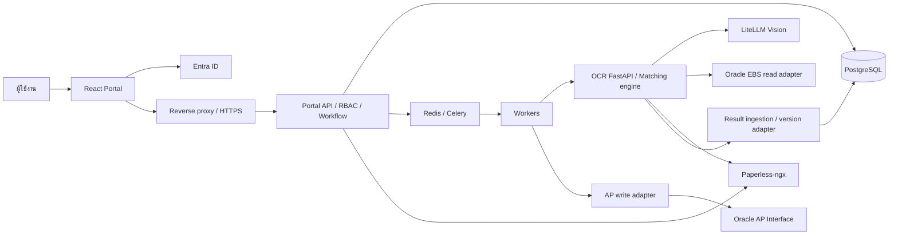

# 01 — Tech stack และสถาปัตยกรรม

> แผนเดิมก่อนผู้ใช้ปรับ scope: รุ่นที่พัฒนาแล้วเป็น JSON receiving portal + PDF viewer ใช้ SQLite สำหรับ local pilot; อ่าน [สถานะล่าสุด](05-implementation-status.md) ซึ่งมีผลเหนือแผนนี้ ส่วน PostgreSQL/Entra/OCR jobs/AP ด้านล่างยังไม่ใช่สิ่งที่ implement แล้ว

สถานะ: ข้อเสนอ ณ 2026-10-01T16:40:53+07:00 · [สารบัญ](README.md)

## 1. แนวทางที่เลือก

ทำ Portal เป็น React SPA แยก component ตามหน้าที่ และมี Python Portal API เป็นเจ้าของ workflow โดย OCR engine เป็นเจ้าของผลการตรวจ วิธีนี้ใช้ความสามารถ Python ที่มีอยู่ต่อ และแยกการปรับ UI ออกจากกฎบัญชี

ระบบเป็น internal portal หลัง login เน้นคิวเอกสาร ตาราง และการดำเนินการ จึงเลือก Vite SPA เป็นค่าเริ่มต้น ไม่จำเป็นต้องเพิ่ม SSR ในระยะแรก React ระบุ Vite เป็นหนึ่งในเครื่องมือสำหรับสร้างแอป และรองรับ TypeScript ([React build guide](https://react.dev/learn/build-a-react-app-from-scratch), [TypeScript](https://react.dev/learn/typescript)) การเลือกนี้เป็นข้อเสนอจากลักษณะงาน ไม่ใช่ข้อกำหนดของ React

## 2. ชุดเทคโนโลยีเป้าหมาย

| ส่วน | เทคโนโลยีที่เสนอ | เหตุผล/ขอบเขต |
|---|---|---|
| Web | React, TypeScript strict, Vite | แยก HTML ก้อนใหญ่เป็น component; ตรวจชนิดข้อมูล API |
| Routing | React Router | URL ของคิว เอกสาร แท็บ สิทธิ์ และ audit; เปิดลิงก์ตรง/ย้อนกลับได้ |
| UI styling | CSS Modules + CSS custom properties | ย้ายสี ระยะ และ responsive CSS เดิมได้ตรงที่สุด ไม่ต้องเปลี่ยนหน้าตาตาม UI framework |
| Accessible primitives | Radix UI เฉพาะ dialog/tabs/dropdown ที่จำเป็น | ตั้งเป้า focus management และ keyboard navigation; ปรับสีและ layout ตาม mockup |
| API state | TanStack Query | cache, loading/error, pagination และ invalidation หลัง action; query key ต้องรวม user/scope/filter |
| Forms | React Hook Form + Zod | เหตุผล หมายเหตุ และ account mapping; server validate ซ้ำเสมอ |
| Tables | TanStack Table | ใช้กับ line items และ audit; ใช้ server pagination เมื่อข้อมูลมาก |
| Document viewer | PDF.js | ดู PDF จริง เปลี่ยนหน้า และกระโดดไปหน้าหลักฐาน; ไม่ใช้ภาพจำลองจาก HTML |
| Identity | Entra ID + MSAL React/browser | Single tenant SPA, Authorization Code + PKCE, access token สำหรับ Portal API |
| Portal backend | Python + FastAPI + Pydantic | login validation, RBAC, queue, workflow, audit, integrations; แยก domain modules |
| Database | PostgreSQL + SQLAlchemy + Alembic | ธุรกรรม อ้างอิงข้อมูล constraints และ migrations |
| Jobs | Celery + Redis broker; PostgreSQL เก็บ job/result หลัก | งาน OCR/AP ต้องไม่หายเมื่อปิดหน้าเว็บ; retry แบบมี idempotency |
| Existing engine | FastAPI OCR service เดิม + rules/pipeline ที่ปรับปรุง | คง Python OCR/rules ไม่ย้ายกฎไป JavaScript |
| DMS | Paperless-ngx เดิม | เก็บไฟล์ต้นฉบับ/version; Portal เก็บ reference และ metadata |
| ERP read | Oracle EBS ORDS MCP adapter เดิม | อ่านใบรับ/PO; เพิ่ม identity และ matching evidence ที่ขาด |
| ERP write | AP Interface adapter ใหม่ | ส่งเฉพาะคำสั่งที่อนุมัติแล้ว; แยก credential และสิทธิ์จาก Oracle read |
| Deploy | Docker images + reverse proxy Nginx; Compose สำหรับ dev/pilot | Web/API เสิร์ฟ origin เดียว; workers แยก process; production ใช้แพลตฟอร์มองค์กร |
| Tests | Vitest, Testing Library, Playwright; pytest + httpx | component, UI parity, role workflow, backend และ contract tests |
| Operations | Structured logs + OpenTelemetry; metrics เข้า monitoring องค์กร | correlation ID ข้าม Portal/job/OCR/AP โดยไม่ใส่ invoice payload ใน log |

TanStack Query ใช้จัดการ server state; selection/modal ใช้ React state และตัวกรองใช้ URL ไม่จำเป็นต้องเพิ่ม global state library ตั้งแต่แรก ([เอกสาร Query](https://tanstack.com/query/latest/docs/framework/react/overview))

Entra SPA ต้องลงทะเบียน redirect URI และใช้ flow ที่รองรับ PKCE; การตรวจ token ใน backend และสิทธิ์รายเอกสารเป็นงานเพิ่มของระบบนี้ ([Microsoft SPA configuration](https://learn.microsoft.com/en-us/entra/identity-platform/scenario-spa-app-configuration))

PDF.js เป็นฐานสำหรับ render PDF ส่วน viewer session, สิทธิ์ และ watermark เป็นงานของ Portal ([PDF.js](https://mozilla.github.io/pdf.js/))

ไม่ล็อกเลขเวอร์ชันล่าสุดในแผนนี้: เมื่อเริ่ม scaffold ให้เลือก stable versions ที่รองรับกัน ตรวจ Node LTS/Python runtime ตามข้อกำหนดแต่ละ package บันทึก exact versions ใน lockfiles และตรึง container image ทดสอบ OCR dependencies เดิมก่อนอัปเกรด

## 3. ขอบเขตระบบ



- **Portal API:** เป็นแหล่งจริงของสิทธิ์ สถานะ workflow ผู้รับผิดชอบ audit และ AP submission; UI ไม่มีอำนาจเปลี่ยนสถานะเอง
- **OCR:** รับไฟล์หรือ DMS reference + round/job identity ส่ง extraction, receipt snapshot, matching evidence และผลกฎ ไม่ตัดสินการอนุมัติของคน
- **AI:** ทำ extraction ตามแนวคิด D1; คณิตศาสตร์และ decision ทำใน deterministic engine
- **PostgreSQL:** เก็บสถานะถาวรและ immutable verification rounds; Redis ไม่ใช่แหล่งเก็บผลลัพธ์เพียงแห่งเดียว
- **Paperless:** เก็บไฟล์; browser ต้องเข้าผ่าน Portal ที่ตรวจ scope ไม่เผย token ของ DMS
- **Oracle:** read adapter อ่านข้อมูลเท่านั้น; AP write เป็น integration ใหม่ ไม่ถือว่า MCP เดิมส่ง AP ได้แล้ว
- โฟลเดอร์ OCR ชื่อ `n8n` แต่ source ที่ตรวจเป็น FastAPI ไม่บังคับติดตั้ง n8n เพื่อรัน Portal; ถ้ามี orchestration ภายนอกต้องทำ inventory เพิ่ม

งานประมวลผลยาวแยก worker; FastAPI เองเสนอระบบอย่าง Celery สำหรับงานที่ต้องกระจายไปหลาย process/server ([Background tasks](https://fastapi.tiangolo.com/tutorial/background-tasks/)) อย่างไรก็ดี durable execution ต้องเพิ่ม job ledger, transactional outbox และ reconciliation เอง ไม่ได้เกิดจากเลือก Celery อย่างเดียว

## 4. โครงสร้างที่จะสร้างเมื่อเริ่ม implementation

```text
invoice-web/
  docs/                       # เอกสารในรอบนี้
  frontend/
    src/
      app/                    # router, providers, auth bootstrap
      features/
        queue/                # KPI, filters, queue list
        documents/            # header, six tabs, action dialogs
        viewer/               # DMS viewer and evidence navigation
        access/               # permissions and account mapping
        audit/
      components/             # shared UI primitives
      api/                    # generated contract types + clients
      styles/                 # tokens, global, typography
      test/                   # synthetic fixtures and setup
  backend/
    app/
      api/                    # public portal routes and internal hooks
      auth/                   # Entra token and policy enforcement
      domain/                 # documents, workflow, access, duplicate, audit
      integrations/           # OCR, DMS, AP adapters
      db/                     # models and repositories
      workers/                # jobs, retry, reconciliation
    migrations/
    tests/
  infra/                      # container, proxy, env templates
OCR service/n8n/               # คงตำแหน่งเดิมในระยะแรก
```

โครงสร้าง modular monolith ส่วนที่ใช้กับ receiving portal ถูกจัดวางแล้วเมื่อ `2026-10-02T09:19:18+07:00` ได้แก่ frontend `app/features/components/api/styles/test` และ backend `api/auth/domain/db/integrations/storage/workers` พร้อม `migrations` และ `infra` boundary อ่านตำแหน่งไฟล์จริงและ dependency rules ที่ [06 — โครงสร้างโปรเจกต์สำหรับพัฒนาต่อ](06-project-structure.md)

ส่วน Entra, PostgreSQL/Alembic runtime, Celery/Redis, DMS และ AP adapter ยังไม่ถูกสร้างเป็นความสามารถใช้งานจริง เพราะต้องมี infrastructure/identity requirements ก่อน โฟลเดอร์ที่เตรียมไว้มี README ระบุเงื่อนไขเพื่อไม่ให้เข้าใจผิดว่า production stack พร้อมแล้ว

## 5. การคงหน้าตาเดิม

- ย้าย design tokens: navy `#0D274D`, teal `#00B5AF`, paper `#F4F7F9`, line `#E2E8EC`; Sarabun สำหรับไทยและ JetBrains Mono สำหรับเลข/รหัส พิจารณา self-host fonts ตามนโยบายองค์กร
- Header สูง 56px, content max-width 1700px, desktop queue 370px + detail, KPI grid และ sticky action bar ตาม mockup
- แยก `AppHeader`, `ScopeBar`, `KpiCards`, `QueueList`, `DocumentHeader`, `StepFlow`, `DocumentTabs`, `RuleTable`, `LineComparisonTable`, `ActionBar`, `ActionDialog`, `DmsViewer`, `AuditTimeline`
- บนจอแคบเปลี่ยนเป็น list/detail สลับหน้า ตารางเลื่อนแนวนอน ปุ่มใช้งานไม่ล้น; layout ที่ mockup ไม่กำหนดให้เสนอภาพเพื่อ review
- สถานะต้องมีข้อความ/ไอคอนร่วมกับสี, modal ใช้ keyboard ได้, loading/empty/error/403/session-expired ต้องออกแบบเพิ่ม
- ไม่ย้าย `innerHTML`, inline `onclick`, global `DOCS` หรือ role dropdown จำลองไป production; สร้าง fixtures ที่ไม่มีข้อมูลจริงสำหรับ dev เท่านั้น

## 6. Deployment และความพร้อมใช้งาน

มี dev, staging, production แยก DB, app registration และ credentials; secrets อยู่ใน secret store ขององค์กร ไม่อยู่ใน frontend bundle หรือเอกสาร

Reverse proxy ให้ SPA fallback, API, authenticated streaming และ PDF ผ่าน HTTPS; ปิด response buffering สำหรับ SSE และกำหนด timeout เหมาะกับ heartbeat จำกัดขนาด/ชนิดไฟล์และ concurrency ของ OCR แยก worker สำหรับ OCR กับ AP เพื่อไม่ให้งานยาวบล็อกกัน

เก็บจำนวนเงินเป็น PostgreSQL `NUMERIC` และ Python `Decimal` พร้อมนโยบาย rounding ที่ผ่านการยืนยัน; ส่ง decimal string ผ่าน JSON และแสดงผลใน browser เท่านั้น ([PostgreSQL numeric](https://www.postgresql.org/docs/current/datatype-numeric.html)) การเปลี่ยน float ใน engine เดิมต้องมี regression tests ไม่แก้ผลคำนวณเงียบ ๆ

ก่อน production ต้องผ่าน backup/restore drill, migration rollback, worker crash recovery, alert สำหรับ failed/stuck jobs และ AP สถานะไม่แน่ชัด; ค่า RPO/RTO, retention, จำนวนผู้ใช้และปริมาณเอกสารให้ infra/เจ้าของข้อมูลกำหนดใน Phase 0
