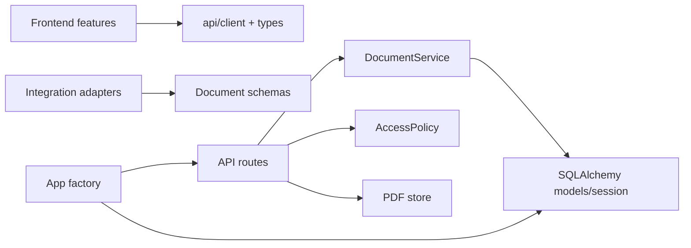

# โครงสร้างโปรเจกต์สำหรับพัฒนาต่อ

อัปเดต `2026-10-02T09:19:18+07:00` · implementation companion ของ [01 — Tech stack และสถาปัตยกรรม](01-tech-stack-and-architecture.md)

## โครงสร้างปัจจุบัน

```text
invoice-web/
  frontend/
    src/
      app/                    # app composition และ URL routing
      api/                    # HTTP client และ API contract types
      components/             # UI/layout ที่ใช้ข้าม feature
      features/
        queue/                # KPI, filters, document queue
        documents/            # detail controller, import และ tabs
        viewer/               # PDF.js viewer
        integration/          # คู่มือเชื่อม JSON/PDF API
      styles/                 # global tokens/layout และ feature overrides
      test/fixtures/          # ข้อมูลสังเคราะห์เท่านั้น
    tests/                    # Playwright user journeys
  backend/
    app/
      api/routes/             # FastAPI transport และ parameter mapping
      auth/                   # access policy boundary
      core/                   # configuration/constants/time
      domain/documents/       # schema และ receiving business rules
      db/                     # SQLAlchemy models/session/bootstrap
      integrations/           # explicit upstream format adapters
      storage/                # PDF validation และ file storage
      workers/                # boundary สำหรับงานยาวในอนาคต
      main.py                 # application factory และ composition เท่านั้น
    migrations/               # Alembic boundary เมื่อย้าย PostgreSQL
    tests/                    # API/domain regression tests
  infra/                      # deployment assets เมื่อมี target จริง
```

## Dependency direction



- `main.py` ประกอบ dependency และ mount frontend เท่านั้น ไม่เพิ่ม route หรือ business rule ในไฟล์นี้
- `api/routes` แปลง HTTP เป็น method call ไม่เขียน SQL และไม่จัดเก็บไฟล์เอง
- `domain/documents` เป็นเจ้าของ idempotency, revision และ document presentation
- `storage` ตรวจและเขียน PDF; database เก็บเฉพาะ metadata/hash
- `integrations` แปลง contract ที่ระบุชัด ห้าม auto-detect JSON หลายรูปแบบ
- frontend feature เรียก server ผ่าน `api/client.ts`; shared component ไม่เรียก endpoint โดยตรง
- ข้อมูลตัวอย่างต้องอยู่ใน `test/fixtures` และไม่มีข้อมูลจริง

## เพิ่มงานใหม่ตรงไหน

| งาน | ตำแหน่งเริ่มต้น |
|---|---|
| เพิ่ม filter/column ในคิว | `frontend/src/features/queue` และ documents list route/service |
| เพิ่มแท็บเอกสาร | `frontend/src/features/documents/tabs` |
| เปลี่ยน PDF viewer | `frontend/src/features/viewer` และ `backend/app/storage` |
| เพิ่ม endpoint | route ใน `backend/app/api/routes` แล้วเรียก domain service |
| เพิ่ม source adapter | `backend/app/integrations` พร้อม contract tests |
| เพิ่ม model/table | `backend/app/db/models.py`; เมื่อใช้ production DB ต้องเพิ่ม Alembic migration |
| เพิ่ม authentication | `backend/app/auth` และ frontend app bootstrap |
| เพิ่มงาน OCR/AP แบบยาว | `backend/app/workers` หลังออกแบบ job ledger/retry/reconciliation |

## สิ่งที่ยังเป็น boundary เปล่า

`workers`, `migrations` และ `infra` มี README อธิบายเงื่อนไขก่อนใช้ แต่ยังไม่ประกาศว่ามี Celery, PostgreSQL/Alembic หรือ production deployment แล้ว โครงสร้างนี้เตรียมตำแหน่งให้เพิ่มได้โดยไม่ปนกับ receiving portal ปัจจุบัน

Backend test มี architecture check ป้องกันการย้าย routes/business logic กลับเข้า `main.py` และตรวจว่า directory หลักยังอยู่ ส่วน behavior ตรวจด้วย API และ Playwright suites เดิม
